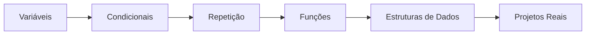

<div align="center">

# 🚀 JavaScript - Curso Completo


### Aprenda JavaScript do zero com exercícios práticos e contextualizados!

[](https://developer.mozilla.org/pt-BR/docs/Web/JavaScript)
[](https://nodejs.org/)
[](LICENSE)

</div>

---

## 📚 Sobre o Projeto

Este repositório contém um **curso completo de JavaScript** com **240+ exercícios práticos** organizados por tópicos. Cada exercício é contextualizado com situações do mundo real para facilitar o aprendizado!

<div align="center">

</div>

---

## 🗂️ Estrutura do Curso

### 📦 1. Variáveis
```javascript
let aprendizado = "constante";
const dedicacao = true;
```
- Tipos de variáveis (var, let, const)
- Tipos de dados primitivos
- **30 exercícios** com contextos reais

### 🔀 2. Condicionais
```javascript
if (estudando) {
  console.log("Você vai longe! 🚀");
}
```
- **IF** - Estruturas básicas (30 exercícios)
- **IF/ELSE** - Decisões binárias (30 exercícios)
- **ELSE IF** - Múltiplas condições (30 exercícios)
- **SWITCH** - Seleção de casos (30 exercícios)

### 🔄 3. Repetição
```javascript
for (let i = 0; i < sucesso; i++) {
  praticar();
}
```
- **FOR** - Loops com contador (30 exercícios)
- **WHILE** - Loops condicionais (30 exercícios)

### ⚡ 4. Funções
```javascript
const aprender = () => "JavaScript é incrível!";
```
- Funções tradicionais e arrow functions
- Parâmetros e retornos
- **30 exercícios** práticos

### 🎯 5. Estruturas de Dados
```javascript
const skills = ["HTML", "CSS", "JavaScript"];
```
- **Arrays** - Manipulação de listas (30 exercícios)
- **Objetos** - Estruturas complexas (30 exercícios)

---

## 📊 Estatísticas

<div align="center">

| Módulo | Exercícios | Status |
|--------|-----------|--------|
| 📦 Variáveis | 30 | ✅ |
| 🔀 Condicionais | 120 | ✅ |
| 🔄 Repetição | 60 | ✅ |
| ⚡ Funções | 30 | ✅ |
| 🎯 Estruturas de Dados | 60 | 🚧 |
| **TOTAL** | **300** | **🎯** |

</div>

---

## 🚀 Como Começar

### Pré-requisitos

- [Node.js](https://nodejs.org/) instalado
- Editor de código (VS Code recomendado)
- Vontade de aprender! 💪

### Executando os Exercícios

```bash
# Clone o repositório
git clone https://github.com/seu-usuario/javascript-curso.git

# Entre na pasta
cd javascript-curso

# Execute qualquer exercício
node "1 - Variáveis/exercicio01.js"
```

<div align="center">

</div>

---

## 💡 Diferenciais

✨ **Exercícios Contextualizados** - Situações do mundo real  
📈 **Progressão Gradual** - Do básico ao avançado  
💬 **Comentários Explicativos** - Código documentado  
🎯 **Prática Intensiva** - Aprenda fazendo  
🌟 **Exemplos Práticos** - Código que funciona  

---

## 📖 Roadmap de Estudos



---

## 🎯 Progresso Pessoal

Marque seu progresso conforme avança:

- [ ] 📦 Variáveis (30 exercícios)
- [ ] 🔀 Condicionais - IF (30 exercícios)
- [ ] 🔀 Condicionais - IF/ELSE (30 exercícios)
- [ ] 🔀 Condicionais - ELSE IF (30 exercícios)
- [ ] 🔀 Condicionais - SWITCH (30 exercícios)
- [ ] 🔄 Repetição - FOR (30 exercícios)
- [ ] 🔄 Repetição - WHILE (30 exercícios)
- [ ] ⚡ Funções (30 exercícios)
- [ ] 🎯 Arrays (30 exercícios)
- [ ] 🎯 Objetos (30 exercícios)

---

## 🤝 Contribuindo

Contribuições são sempre bem-vindas! Sinta-se à vontade para:

1. 🍴 Fork o projeto
2. 🔨 Criar uma branch (`git checkout -b feature/NovoExercicio`)
3. 💾 Commit suas mudanças (`git commit -m 'Adiciona novo exercício'`)
4. 📤 Push para a branch (`git push origin feature/NovoExercicio`)
5. 🎉 Abrir um Pull Request

---

## 📝 Licença

Este projeto está sob a licença MIT. Veja o arquivo [LICENSE](LICENSE) para mais detalhes.

---

<div align="center">

## 💻 Feito com ❤️ e JavaScript


### ⭐ Se este projeto te ajudou, deixe uma estrela!

**Bons estudos e happy coding! 🚀✨**

</div>
